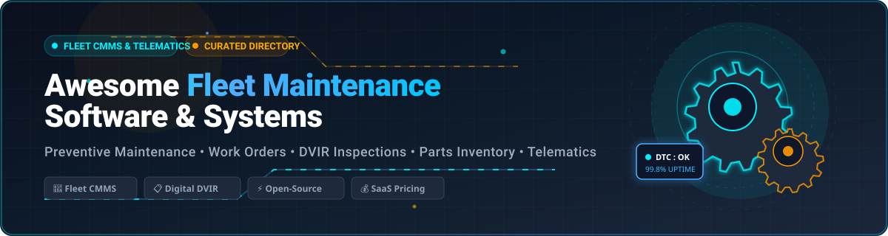

# Awesome Fleet Maintenance Software 

  

> 🚛 A curated directory of top **Fleet Maintenance Software (CMMS)**, **Fleet Management Systems (FMS)**, digital **DVIR inspection platforms**, and self-hosted **open-source vehicle tracking** solutions.

  
  
  
  
  
  

---

## 📌 Overview

Fleet maintenance software (also known as **Fleet CMMS** or **Enterprise Asset Management** for vehicles) automates 🛠️ **preventive maintenance (PM) scheduling**, 📝 **work order management**, 📱 **digital Driver Vehicle Inspection Reports (DVIR)**, 📦 **parts inventory**, ⛽ **fuel logging**, 🛡️ **warranty tracking**, and 📡 **telematics/OBD-II integration**.

Whether you manage 🚚 commercial trucking fleets, 🚌 municipal transit, 🚐 service vans, 🚜 construction equipment, or 🚗 personal vehicles, choosing between cloud-hosted SaaS platforms and self-hosted open-source software is critical for optimizing Total Cost of Ownership (TCO) and regulatory compliance (e.g., DOT & FMCSA).

---

## 📑 Table of Contents

- [🔍 Key Features & Fleet Maintenance Keywords](#-key-features--fleet-maintenance-keywords)
- [☁️ SaaS / Cloud-Hosted Fleet Maintenance Platforms](#️-saas--cloud-hosted-fleet-maintenance-platforms)
- [🛠️ Open-Source & Self-Hosted Fleet Management Projects](#️-open-source--self-hosted-fleet-management-projects)
- [⚖️ Software Selection Guide: SaaS vs. Open-Source](#️-software-selection-guide-saas-vs-open-source)
- [❓ Frequently Asked Questions (FAQ)](#-frequently-asked-questions-faq)
- [📈 Star History](#-star-history)
- [🤝 How to Contribute](#-how-to-contribute)
- [⚠️ Disclaimer](#️-disclaimer)

---

## 🔍 Key Features & Fleet Maintenance Keywords

- ⏱️ **Preventive Maintenance (PM) Scheduling**: Calendar-, mileage-, and engine-hour-based service reminders.
- 🔧 **Work Orders & Repair Shop Network**: Automated maintenance work orders, technician labor tracking, and billing.
- 📋 **Electronic DVIR (eDVIR)**: DOT/FMCSA-compliant mobile pre-trip and post-trip vehicle walkaround inspections.
- 📦 **Parts & Tire Inventory Management**: Stock tracking, reorder alerts, parts usage auditing, and supplier catalogs.
- ⛽ **Fuel & Expense Tracking**: Fuel card integrations (WEX, Comdata), IFTA fuel tax reporting, and cost-per-mile analysis.
- 📡 **Telematics & Diagnostics (OBD-II / J1939)**: Real-time DTC fault codes, engine health, and GPS breadcrumbs.

---

## ☁️ SaaS / Cloud-Hosted Fleet Maintenance Platforms

Commercial fleet maintenance software and Computerized Maintenance Management Systems (CMMS) offering out-of-the-box mobile apps, automated compliance workflows, and certified repair shop integrations.

| Platform | Description & Core Focus | Starting Pricing | Free Tier / Free Trial Limits |
| :--- | :--- | :--- | :--- |
| **[Fleetio](https://www.fleetio.com/)** | 🏆 Leading fleet-native CMMS focused on maintenance workflows, work orders, parts inventory, fuel tracking, TCO analysis, and repair-shop network integrations. | Starts at **$4/vehicle/month** (Essential tier billed annually) or $5/vehicle/month (monthly billing); 5 vehicle minimum. | **14-day free trial** with full feature access and no credit card required. No permanent free tier. |
| **[Whip Around](https://whiparound.com/)** | 📋 Inspection-first platform specializing in digital DVIRs, defect-to-work-order flows, and driver-led compliance for fleets of all sizes. | Paid plans start at **$5/asset/month** (Standard plan) or $9/asset/month (Pro plan). | **Free Forever plan** limited to 1 asset and 1 user. Also offers a **7-day free trial** of the Pro plan with no credit card required. |
| **[Samsara Maintenance](https://www.samsara.com/)** | 📡 Telematics-driven maintenance capabilities within the Samsara platform, using real-time vehicle diagnostics and fault codes to trigger service. | Software subscriptions typically start at **~$27 to $33/vehicle/month** (hardware units ~$99–$148/vehicle, standard 3-year contract). | **30-day free trial** available via sales consultation with return of hardware required within 30 days. No permanent free tier. |
| **[AUTOsist](https://www.autosist.com/)** | 🚗 Affordable and user-friendly fleet maintenance software popular with smaller fleets for work orders, scheduling, and basic tracking. | Starts at **$5/vehicle/month** (billed annually) or $6/vehicle/month (monthly); minimum billing threshold of $59/month (covers up to ~10 assets). | **14-day free trial** with full platform access and no credit card required. No permanent free tier. |
| **[Fiix Fleet / Rockwell Fiix](https://fiixsoftware.com/)** | 🏭 CMMS platform with strong fleet and mixed-asset capabilities for preventive maintenance, work orders, and inventory. | Paid plans start at **$45/user/month** (Basic tier billed annually) or $75/user/month (Professional tier). | **Free Forever plan** limited to 3 users and up to 25 active preventive maintenance (PM) tasks. Free product demos available for paid tiers. |
| **[Fleet Complete](https://www.fleetcomplete.com/)** | 🌐 Fleet management suite that includes maintenance scheduling, asset tracking, and operational tools. | Starts at approximately **$18 to $25/vehicle/month** (Basic tracker plan, typically with 36-month contract; hardware ~$80–$175). | **No self-serve free trial** or free tier. Evaluation via scheduled live product demonstration and customized pilot. |
| **[Verizon Connect Reveal](https://www.verizonconnect.com/)** | 🛰️ Telematics and fleet platform with maintenance features, diagnostics, and compliance tools. | Starts at approximately **$20 to $45/vehicle/month** (typically standard 36-month contract). | **30-day risk-free trial** (available via consultation starting 5 days post-hardware shipment). No permanent free tier. |
| **[Simply Fleet](https://www.simplyfleet.app/)** | ⚡ Straightforward fleet maintenance and management software aimed at ease of use and core tracking needs. | Paid plans start at **$2/vehicle/month** ($20/vehicle/year for Essential) and $4/vehicle/month (Advanced). | **Free Forever plan** for fleets up to 5 vehicles (core features included). Also offers a **14-day free trial** of paid plans with no credit card required. |
| **[Maintenance Pro / Fleet Maintenance Pro](https://www.fleetmaintenancepro.com/)** | 💻 Dedicated fleet maintenance software covering work orders, parts, and service history. | Cloud subscriptions start at **$24 to $30/user/month** (or one-time on-premise desktop purchase starting at $649 for Standard). | **30-day fully functional free trial** for all editions. No permanent free tier. |
| **[Chevin FleetWave](https://www.chevinfleet.com/)** | 🏢 Enterprise fleet management solution with strong maintenance, compliance, and operational modules. | Core plan starts at approximately **£5 (~$6.50)/vehicle/month** (ancillary non-vehicle equipment starting at ~£0.50/item/month). | **14-day free trial** available upon request via sales team setup. No permanent free tier. |

---

## 🛠️ Open-Source & Self-Hosted Fleet Management Projects

Self-hosted and open-source applications for privacy-conscious organizations, self-hosters, and businesses seeking full data ownership without recurring per-vehicle fees.

| Project | Description | Tech Stack / Focus | Repository |
| :--- | :--- | :--- | :--- |
| **[Fleetms](https://github.com/jmnda-dev/fleetms)** | 🚚 Open-source fleet maintenance and management software for tracking vehicles, service history, fuel, and related operations. | Full-stack fleet management | [GitHub](https://github.com/jmnda-dev/fleetms) |
| **[Tracktor](https://github.com/javedh-dev/tracktor)** | 🚜 Self-hosted vehicle tracking and maintenance system for fuel logs, service history, insurance/compliance reminders, and multi-vehicle dashboards. | Vehicle tracking & reminders | [GitHub](https://github.com/javedh-dev/tracktor) |
| **[MotoMate](https://github.com/hawkinslabdev/motomate)** | 🏍️ Self-hosted personal and small-fleet vehicle maintenance tracker for mileage, service history, spending, and reminders. | Small fleet / Personal maintenance | [GitHub](https://github.com/hawkinslabdev/motomate) |
| **[MyGarage](https://github.com/homelabforge/mygarage)** | 🏠 Self-hosted vehicle maintenance platform with VIN decoding, service records, fuel logging, reminders, and optional OBD/telemetry integration. | VIN decoding, Homelab & OBD integration | [GitHub](https://github.com/homelabforge/mygarage) |
| **[SAMFMS](https://github.com/COS301-SE-2025/SAMFMS)** | 🧩 Modular open-source fleet management system with maintenance, location, trips, and driver/vehicle modules for small-to-medium fleets. | Modular architecture & trips | [GitHub](https://github.com/COS301-SE-2025/SAMFMS) |
| **[SuperCMMS / Open-Source CMMS](https://github.com/)** | ⚙️ Open-source enterprise asset management and CMMS platforms adaptable to vehicle fleets and work-order management. | Work orders & asset management | [GitHub](https://github.com/) |

### 🧩 Additional Open-Source Fleet Ecosystem Tools

- 🔌 **OBD-II and Telematics Open Tools**: Libraries (Python-OBD, Freematics) for reading diagnostic trouble codes (DTC) and CAN-bus telemetry.
- ⛽ **Fuel & Expense Loggers**: Lightweight tools for fuel economy, mpg/L-per-100km calculations, and cost analytics.
- 📱 **Mobile PWA Inspections**: Responsive checklist frameworks adaptable for driver electronic DVIRs.
- 🗄️ **ERP & Low-Code Integrations**: Odoo Maintenance and ERPNext modules customized for vehicle fleets and workshop inventories.
- 📊 **Fleet Analytics & Dashboards**: Open-source BI platforms like Metabase and Grafana connecting to MySQL/PostgreSQL fleet databases.

---

## ⚖️ Software Selection Guide: SaaS vs. Open-Source

| Evaluation Criteria | ☁️ Commercial SaaS Fleet CMMS | 🛠️ Open-Source / Self-Hosted |
| :--- | :--- | :--- |
| **Upfront Cost** | Low (monthly/annual subscription) | Free software (requires server/hosting infrastructure) |
| **Long-Term Cost** | Scales with fleet size ($2–$45+/vehicle/mo) | Predictable, fixed infrastructure costs |
| **Deployment Time** | Instant setup with prebuilt mobile apps | Requires technical configuration & hosting setup |
| **Compliance & DVIR** | Built-in DOT/FMCSA compliant workflows | Requires custom checklist configuration |
| **Data Ownership** | Vendor-managed cloud | 100% self-hosted, sovereign data ownership |
| **Shop Integrations** | Pre-integrated national repair networks | Custom API integrations required |

---

## ❓ Frequently Asked Questions (FAQ)

### What is Fleet Maintenance Software?
Fleet maintenance software (Fleet CMMS) is dedicated software designed to track vehicle service history, schedule preventive maintenance, monitor DTC fault codes, manage work orders and mechanics, track parts inventory, and ensure safety compliance.

### What is the difference between Fleet Tracking (Telematics) and Fleet Maintenance (CMMS)?
Fleet tracking (Telematics) focuses primarily on GPS location, real-time routing, driver behavior, and geofencing. Fleet Maintenance (CMMS) focuses on the physical health of assets—preventive maintenance intervals, parts replacement, mechanic labor, repair costs, and DVIR defect resolutions. Leading platforms integrate both.

### Can open-source fleet software replace enterprise SaaS?
For small to medium fleets, self-hosted solutions like **Fleetms**, **Tracktor**, or **MyGarage** combined with BI dashboards (Grafana/Metabase) provide robust service logging and reminders without recurring licensing fees. Enterprise fleets with outsourced repair billing and nationwide compliance needs often prefer commercial SaaS platforms.

---

## 📈 Star History

---

## 🤝 How to Contribute

Contributions to keep this directory up-to-date and comprehensive are welcome!

1. 🍴 Fork this repository.
2. ✍️ Add or update entries in `README.md` maintaining accurate links, verified pricing, and feature details.
3. 🚀 Submit a Pull Request with a brief explanation of your change.

---

## ⚠️ Disclaimer

- 📌 This is a community-curated list intended for research and educational purposes.
- 🛡️ Fleet maintenance systems often manage safety-critical and legally regulated records (DOT, FMCSA, DVIR). Ensure any chosen tool complies with your jurisdiction's commercial vehicle safety regulations.

---

**Keywords**: fleet maintenance software, fleet CMMS, vehicle preventive maintenance, DVIR inspection app, fleet management software, open source fleet management, self hosted vehicle maintenance tracker, work order management, telematics maintenance, fleet inventory management.
